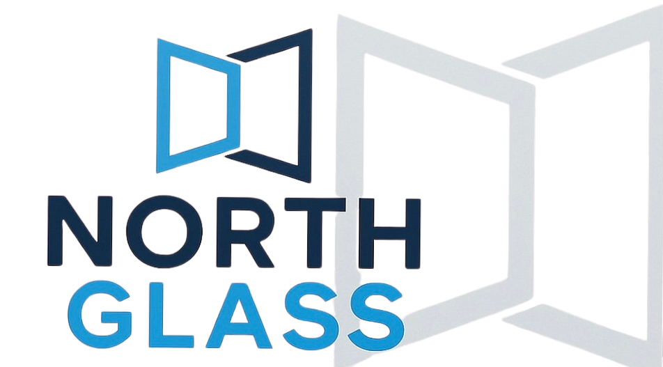

# North Glass NC

<div align="center">



**Premium Glass & Aluminum Solutions in North Carolina**

[🌐 Live Website](https://northglassnc.com) • [📧 Contact](https://northglassnc.com/contact) • [💼 Request Quote](https://northglassnc.com/request-quote)

[](https://nextjs.org/)
[](https://www.typescriptlang.org/)
[](https://tailwindcss.com/)
[](https://vercel.com)

</div>

---

## 📖 Overview

North Glass NC is a modern, high-performance website showcasing premium glass and aluminum installation services across North Carolina. The site features a beautiful, responsive design with smooth animations, comprehensive service pages, case studies, and an integrated contact system.

### 🎯 Key Features

- **🎨 Modern UI/UX** - Clean, professional design with smooth animations using Motion
- **📱 Fully Responsive** - Optimized for all devices from mobile to desktop
- **🚀 High Performance** - Built with Next.js 15 App Router for optimal speed
- **📧 Contact System** - Integrated email functionality via Google Workspace SMTP
- **🖼️ Image Gallery** - Dynamic galleries with before/after sliders
- **📝 Blog System** - SEO-optimized blog with dynamic routing
- **💼 Case Studies** - Showcase of completed projects with rich details
- **🔍 SEO Optimized** - Comprehensive metadata, sitemaps, and structured data
- **📊 Analytics** - Vercel Analytics integration for insights
- **♿ Accessible** - WCAG compliant with semantic HTML

---

## 🛠️ Technology Stack

### Core Framework
- **[Next.js 15.5.2](https://nextjs.org/)** - React framework with App Router
- **[React 19.1](https://react.dev/)** - UI library
- **[TypeScript 5.x](https://www.typescriptlang.org/)** - Type safety

### Styling & UI
- **[Tailwind CSS 4.x](https://tailwindcss.com/)** - Utility-first CSS framework
- **[Motion 12.23](https://motion.dev/)** - Animation library
- **[Lucide React](https://lucide.dev/)** - Icon library
- **[clsx](https://github.com/lukeed/clsx)** - Conditional className utility

### Email & Communication
- **[Nodemailer 7.0](https://nodemailer.com/)** - Email sending
- **Google Workspace SMTP** - Email delivery

### Development Tools
- **[ESLint 9](https://eslint.org/)** - Code linting
- **[Turbopack](https://turbo.build/pack)** - Fast bundler for development
- **[@xenova/transformers](https://huggingface.co/docs/transformers.js)** - ML utilities

### Deployment & Analytics
- **[Vercel](https://vercel.com/)** - Hosting and deployment
- **[@vercel/analytics](https://vercel.com/analytics)** - Web analytics

---

## 📁 Project Structure

```
north-glass/
├── app/                          # Next.js App Router
│   ├── (site)/                   # Main site layout
│   │   ├── _components/          # Shared components
│   │   │   ├── Footer.tsx
│   │   │   ├── Header.tsx
│   │   │   ├── Gallery.tsx
│   │   │   └── ...
│   │   └── page.tsx              # Homepage
│   ├── about/                    # About page
│   ├── blog/                     # Blog section
│   │   ├── [slug]/               # Dynamic blog posts
│   │   └── page.tsx              # Blog index
│   ├── case-studies/             # Portfolio case studies
│   │   ├── [slug]/               # Individual case studies
│   │   └── page.tsx              # Case studies index
│   ├── contact/                  # Contact page
│   ├── request-quote/            # Quote request form
│   ├── services/                 # Service pages
│   │   ├── frameless-glass-shower-doors/
│   │   ├── aluminum-windows/
│   │   ├── mirrors/
│   │   └── ...
│   ├── api/                      # API routes
│   │   ├── contact/              # Contact form handler
│   │   ├── quote/                # Quote form handler
│   │   └── test-email/           # Email config tester
│   ├── layout.tsx                # Root layout
│   ├── sitemap.ts                # Dynamic sitemap
│   └── globals.css               # Global styles
├── lib/                          # Utility libraries
│   ├── blogData.ts               # Blog content data
│   ├── galleryData.ts            # Gallery images data
│   ├── imageData.ts              # Image collections
│   └── email.ts                  # Email utilities
├── public/                       # Static assets
│   ├── images/                   # Image assets
│   │   ├── frameless-glass-shower-doors/
│   │   ├── aluminum-windows/
│   │   ├── mirrors/
│   │   └── ...
│   └── favicon-NG/               # Favicon variants
├── scripts/                      # Utility scripts
│   ├── normalize-incoming.mjs    # Image normalization
│   ├── generate-image-manifest.mjs
│   ├── move-images-from-manifest.mjs
│   └── auto-categorize.mjs       # AI-powered categorization
├── .env.local                    # Environment variables (local)
├── package.json
├── tsconfig.json
└── tailwind.config.ts
```

---

## 🚀 Getting Started

### Prerequisites

- **Node.js 22.x** or higher
- **npm**, **yarn**, **pnpm**, or **bun**
- Google Workspace account (for email functionality)

### Installation

1. **Clone the repository**
   ```bash
   git clone https://github.com/omerakben/north-glass.git
   cd north-glass
   ```

2. **Install dependencies**
   ```bash
   npm install
   ```

3. **Set up environment variables**

   Create a `.env.local` file in the root directory:
   ```bash
   # SMTP Configuration (Google Workspace)
   SMTP_HOST=smtp.gmail.com
   SMTP_PORT=465
   SMTP_USER=info@northglassnc.com
   SMTP_PASS=your_app_password_here

   # Email Recipients
   LEADS_TO=info@northglassnc.com
   LEADS_FROM=info@northglassnc.com
   ```

   > **Note:** Generate a Google Workspace app password at [myaccount.google.com/apppasswords](https://myaccount.google.com/apppasswords)

4. **Run the development server**
   ```bash
   npm run dev
   ```

5. **Open your browser**

   Navigate to [http://localhost:3000](http://localhost:3000)

---

## 🔧 Available Scripts

| Script | Description |
|--------|-------------|
| `npm run dev` | Start development server with Turbopack |
| `npm run build` | Build for production |
| `npm run start` | Start production server |
| `npm run lint` | Run ESLint |
| `npm run typecheck` | Run TypeScript type checking |
| `npm run images:normalize` | Normalize incoming images |
| `npm run images:manifest` | Generate image manifest |
| `npm run images:move` | Move images from manifest |
| `npm run images:auto` | Auto-categorize images with AI |

---

## 🌍 Environment Variables

### Required for Production

| Variable | Description | Example |
|----------|-------------|---------|
| `SMTP_HOST` | SMTP server hostname | `smtp.gmail.com` |
| `SMTP_PORT` | SMTP server port | `465` |
| `SMTP_USER` | Email account username | `info@northglassnc.com` |
| `SMTP_PASS` | App password for email | `your_app_password` |
| `LEADS_TO` | Recipient for lead emails | `info@northglassnc.com` |
| `LEADS_FROM` | Sender email address | `info@northglassnc.com` |

### Setting Up Email

1. Enable 2-Factor Authentication on your Google Workspace account
2. Generate an app password at [myaccount.google.com/apppasswords](https://myaccount.google.com/apppasswords)
3. Use the 16-character app password as `SMTP_PASS`

### Testing Email Configuration

```bash
# Test SMTP connection (without sending)
curl -X POST http://localhost:3000/api/test-email

# Test contact form
curl -X POST http://localhost:3000/api/contact \
  -F "name=Test User" \
  -F "email=test@example.com" \
  -F "phone=984-900-6201" \
  -F "message=Testing email"
```

---

## 📦 Deployment

### Deploy to Vercel (Recommended)

1. **Push code to GitHub**
   ```bash
   git push origin main
   ```

2. **Import to Vercel**
   - Go to [vercel.com/new](https://vercel.com/new)
   - Import your repository
   - Configure environment variables
   - Deploy!

3. **Set Environment Variables**

   In Vercel Dashboard → Settings → Environment Variables, add:
   - `SMTP_PASS` (your Google app password)

   Other variables use defaults from the code.

4. **Configure Production Branch**
   - Settings → Git → Production Branch: `main`

### Deploy to Other Platforms

The site can be deployed to any platform supporting Next.js:
- **Netlify**: Use Next.js plugin
- **AWS Amplify**: Configure build settings
- **Self-hosted**: Use `npm run build && npm run start`

---

## 🔄 Development Workflow

### Branch Strategy

- **`main`** - Production branch (clean, deployed to production)
- **`develop`** - Development branch (includes dev files and documentation)

### Making Changes

1. **Start from develop branch**
   ```bash
   git checkout develop
   git pull origin develop
   ```

2. **Create feature branch** (optional)
   ```bash
   git checkout -b feature/your-feature-name
   ```

3. **Make changes and test**
   ```bash
   npm run dev
   npm run lint
   npm run typecheck
   ```

4. **Commit changes**
   ```bash
   git add .
   git commit -m "feat: your feature description"
   ```

5. **Push to develop**
   ```bash
   git push origin develop
   ```

6. **Merge to main for production**
   ```bash
   git checkout main
   git merge develop
   git push origin main
   ```

---

## 🎨 Services Offered

- **Frameless Glass Shower Doors** - Custom designs for modern bathrooms
- **Aluminum Windows** - Energy-efficient window installations
- **Mirrors** - Custom mirrors for residential and commercial spaces
- **Glass Office Doors** - Professional interior glass solutions
- **Commercial Storefronts** - High-impact commercial glass systems
- **Sliding Glass Patio Doors** - Indoor-outdoor living solutions
- **Staircase Glass Railings** - Modern safety with elegance
- **Window Replacement** - Energy-efficient upgrades
- **Architectural Design Services** - Custom glass design solutions
- **Pergolas** - Outdoor living space enhancements

---

## 📊 Performance

- **Lighthouse Score**: 95+ across all metrics
- **Core Web Vitals**: Excellent
- **Static Generation**: 43 pages pre-rendered at build time
- **Image Optimization**: Automatic with Next.js Image component
- **Code Splitting**: Automatic route-based splitting

---

## 🤝 Contributing

This is a private project for North Glass NC. For feature requests or bug reports, please contact the development team.

---

## 📝 License

© 2025 North Glass NC. All rights reserved.

This project is proprietary and confidential. Unauthorized copying, distribution, or use of this software is strictly prohibited.

---

## 👨‍💻 Built By

**[Omer Akben](https://omerakben.com)**

Full-stack developer specializing in modern web applications, AI integration, and e-commerce solutions.

- 🌐 Website: [omerakben.com](https://omerakben.com)
- 💼 Portfolio: Custom web applications, React/Next.js development
- 🛠️ Technologies: Next.js, React, TypeScript, Node.js, AI/ML integration

### Development Stack
- **Design & Development**: Custom Next.js application with TypeScript
- **UI/UX Design**: Modern, responsive design with Tailwind CSS
- **Email Integration**: Google Workspace SMTP configuration
- **SEO Optimization**: Comprehensive metadata and structured data
- **Performance**: Optimized for Core Web Vitals
- **Analytics**: Vercel Analytics integration

---

## 📞 Contact

**North Glass NC**
- 📱 Phone: (984) 900-6201
- 📧 Email: info@northglassnc.com
- 🌐 Website: [northglassnc.com](https://northglassnc.com)
- 📍 Service Area: Raleigh, Durham, Cary, Chapel Hill, and surrounding areas

---

<div align="center">

**Built with ❤️ by [Omer Akben](https://omerakben.com)**

*Crafted for excellence, designed for performance*

</div>
